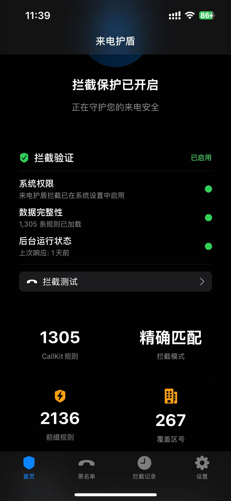
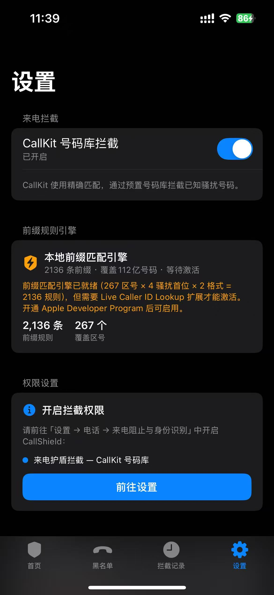

# CallShield 来电护盾

<p align="center">
  
  
  
  
</p>

iOS 来电拦截应用，覆盖全国 **267 个非偏远地区区号 × 4 个骚扰首位号段**，通过前缀匹配引擎实现 **112 亿座机号码** 的拦截覆盖。

## UI 界面

<p align="center">
  
  &nbsp;&nbsp;&nbsp;
  
</p>

| 首页 | 设置 |
|------|------|
| 拦截保护状态总览 | CallKit 拦截开关 |
| 1305 条精确匹配规则 | 前缀匹配引擎详情（2136 条规则 / 112 亿覆盖） |
| 系统权限验证 | 一键跳转系统权限设置 |
| 后台运行状态检测 | PIR 服务器配置（可选） |

## 核心特性

| 特性 | 说明 |
|------|------|
| **CallKit 号码库拦截** | 预置号码精确匹配，系统级静默拦截（对方听到忙音） |
| **前缀匹配引擎** | 2136 条前缀规则覆盖 112 亿号码，存储仅需 ~56KB |
| **Live Caller ID 扩展** | iOS 17+ 来电实时前缀匹配（需付费开发者账号） |
| **PIR 服务器** | 可选的隐私保护查询服务器，服务器无法获知查询号码 |
| **双格式覆盖** | 本地格式 + E.164 格式，确保不同来电显示格式都能匹配 |
| **全国区号覆盖** | 10 个直辖市/大区中心 + 257 个地级市区号 |

## 拦截原理

### 前缀匹配 vs 精确匹配

```
CallKit 精确匹配：02032445445 → 只拦截这一个号码
前缀匹配引擎：  0203*         → 拦截 0203 开头的 1000 万个号码
```

一条前缀规则就能覆盖一个骚扰号段的全部号码。267 区号 × 4 骚扰首位 = **1068 条规则 → 覆盖 112 亿号码**。

### 骚扰首位号段

座机号码的首位数字对应不同用途：

| 首位 | 类型 | 骚扰概率 |
|------|------|---------|
| 3 | 企业办公 | 高 |
| 5 | 商业服务 | 高 |
| 6 | 公司座机 | 高 |
| 8 | 商务号码 | 高 |
| 1/2/4/7/9/0 | 个人/政府/特殊 | 低 |

### 号码格式

来电号码有两种格式，两种都需要覆盖：

| 格式 | 示例 | 说明 |
|------|------|------|
| 本地格式 | `02032445445` | 区号 0 + 城市码 + 8 位号码 |
| E.164 格式 | `862032445445` | 86 + 去掉前导 0 的区号 + 8 位号码 |

## 项目结构

```
CallShield/
├── CallShield/                              # 主 App
│   ├── CallShieldApp.swift                  # App 入口
│   ├── Models/
│   │   ├── BlockNumber.swift                # 拦截号码模型
│   │   └── BlockRecord.swift                # 拦截记录模型
│   ├── Services/
│   │   ├── AppGroupManager.swift            # App Group 数据共享
│   │   ├── BlockManager.swift               # 拦截管理器
│   │   ├── BlockCheckService.swift          # 拦截验证服务
│   │   ├── PresetNumbers.swift              # 预置号码数据（267 区号）
│   │   └── SpamPrefixResolver.swift         # 前缀匹配引擎
│   ├── Views/
│   │   ├── ContentView.swift                # TabView 主框架
│   │   ├── HomeView.swift                   # 首页状态总览
│   │   ├── BlockListView.swift              # 黑名单列表
│   │   ├── AddNumberView.swift              # 添加号码
│   │   ├── BlockRecordView.swift            # 拦截记录
│   │   └── SettingsView.swift               # 设置页面
│   ├── Assets.xcassets/
│   ├── CallShield.entitlements
│   └── Info.plist
│
├── CallShieldCallDirectory/                  # Call Directory Extension（当前激活）
│   ├── CallDirectoryHandler.swift            # 号码展开 + E.164 规范化
│   ├── BlockNumber+Extension.swift           # Extension 数据模型
│   ├── CallShieldCallDirectory.entitlements
│   └── Info.plist
│
├── CallShieldLiveCallerID/                   # Live Caller ID Extension（需付费开发者账号）
│   ├── LiveCallerIDExtension.swift           # 来电实时前缀匹配入口
│   ├── LiveCallerIDHandler.swift             # 辅助类型定义
│   ├── SpamPrefixResolver.swift              # 前缀匹配引擎（Extension 副本）
│   ├── CallShieldLiveCallerID.entitlements   # caller-id + call-blocking 权限
│   └── Info.plist
│
├── PIRServer/                                # PIR 服务器（可选部署）
│   ├── pir_server.py                         # Flask 前缀匹配服务器
│   ├── requirements.txt                      # Python 依赖
│   └── README.md                             # 服务器部署指南
│
└── CallShield.xcodeproj/                     # Xcode 项目文件
```

## 双层拦截架构

```
来电 ──→ iOS 系统
           │
           ├─→ Call Directory Extension ──→ 精确匹配（预置号码库）
           │   ✅ 免费开发者账号可用
           │   ✅ 退出 App 后仍生效
           │   ⚠️ 400 万条上限，覆盖率有限
           │
           └─→ Live Caller ID Extension ──→ 前缀匹配（实时判断）
               ⚠️ 需要付费开发者账号（688 元/年）
               ✅ 2136 条规则覆盖 112 亿号码
               ✅ 纯本地运算，微秒级响应
               ✅ 可选 PIR 服务器升级
```

### 模式对比

| | CallKit 精确匹配 | Live Caller ID 前缀匹配 |
|---|---|---|
| **开发者账号** | 免费 | 付费 (688 元/年) |
| **匹配方式** | 号码库精确匹配 | 区号+首位前缀匹配 |
| **规则数量** | ~2,608 条展开为 400 万条 | 2,136 条前缀 |
| **覆盖号码** | ~400 万 | **112 亿** |
| **覆盖率** | 低（座机号太多无法全存） | **高**（一条前缀覆盖 1000 万） |
| **存储占用** | ~31 MB | ~56 KB |
| **查询延迟** | 系统查找 | 微秒级（内存匹配） |
| **退出 App** | ✅ 仍生效 | ✅ 仍生效 |
| **拦截动作** | 静默拦截 | 识别标签 + 自动拦截 (iOS 18.2+) |

## 快速开始

### 环境要求

- iOS 17.0+
- Xcode 26.0+
- Swift 6.0+
- 真机测试（模拟器不支持 CallKit 来电拦截）

### 编译安装

1. **克隆项目**
   ```bash
   git clone https://github.com/zanefor/ios-CallShield.git
   cd CallShield
   ```

2. **打开 Xcode 项目**
   ```bash
   open CallShield.xcodeproj
   ```

3. **配置签名**
   - 选择 `CallShield` Target → Signing & Capabilities → 勾选 "Automatically manage signing" → 选择你的 Developer Team
   - 选择 `CallShieldCallDirectory` Target → 同样配置

4. **配置 App Group**

   两个 Target 都需要添加 App Group：
   - `CallShield` Target → + Capability → App Groups → 添加 `group.com.callshield.RH6MHK8BB6.shared`
   - `CallShieldCallDirectory` Target → 同样添加

   > App Group identifier 必须与 `AppGroupManager.appGroupIdentifier` 一致。

5. **构建运行**

   选择你的 iPhone 作为运行目标 → Cmd+R

6. **开启拦截权限**

   安装后在 iPhone 上手动开启：
   **设置 → 电话 → 来电阻止与身份识别 → 开启「来电护盾拦截」**

### 启用 Live Caller ID 扩展（可选）

如需启用前缀匹配扩展，需额外步骤：

1. 开通 [Apple Developer Program](https://developer.apple.com/programs/)（688 元/年）
2. 在 Apple Developer 后台注册 App ID：`com.callshield.CallShield.LiveCallerID`
   - 勾选 Capability：App Groups + Incoming Call Extensions
3. 生成包含 `caller-id` + `call-blocking` 权限的 Provisioning Profile
4. 在 Xcode 中将 `CallShieldLiveCallerID` target 添加到项目并配置签名
5. 在 Info.plist 中确认扩展点为 `com.apple.identitylookup.call-communication`

## PIR 服务器部署（可选）

PIR 服务器提供隐私保护的号码查询，服务器无法获知用户查询的具体号码。

详细部署指南见 [PIRServer/README.md](PIRServer/README.md)。

快速启动：
```bash
cd PIRServer
pip install -r requirements.txt
python3 pir_server.py  # 默认监听 0.0.0.0:8443
```

## 预置号码数据

首次启动自动加载以下预置规则：

| 分组 | 说明 | 数量 |
|------|------|------|
| 华北座机 | 北京/天津/河北/山西/内蒙古 | 56 条前缀 |
| 东北座机 | 辽宁/吉林/黑龙江 | 52 条前缀 |
| 华东座机 | 上海/江苏/浙江/安徽/福建/山东 | 72 条前缀 |
| 华中座机 | 湖北/湖南/河南/江西 | 60 条前缀 |
| 华南座机 | 广东/广西/海南 | 64 条前缀 |
| 西南座机 | 重庆/四川/贵州/云南/西藏 | 64 条前缀 |
| 西北座机 | 陕西/甘肃/青海/宁夏/新疆 | 64 条前缀 |

每条前缀在 CallKit 中自动展开为精确号码（预算 400 万条），在 Live Caller ID 中直接前缀匹配。

## 技术细节

### CallKit 号码展开策略

CallKit 只支持精确匹配，前缀通过区间展开实现伪前缀匹配：

```
前缀 "0203" → 展开为 02030000000, 02030000001, ..., 02039999999
```

预算 400 万条 / 2608 组合 ≈ 1535 条/组合，每个前缀覆盖该号段的前 1535 个号码。

### 前缀匹配算法

```swift
// 来电号码: 02032445445
// 1. 本地格式前缀匹配: "0203" ∈ localPrefixes → 命中！
// 2. E.164 格式前缀匹配: "86203" ∈ e164Prefixes → 命中！
// 3. 回退检测: 区号 "020" + 首位 "3" ∈ spamFirstDigits → 命中！
```

三层匹配策略确保高命中率：

1. **预计算前缀集合** — 微秒级 Set 查询
2. **E.164 格式覆盖** — 兼容不同来电显示格式
3. **回退区号检测** — 兜底保障

### iOS 版本差异

| iOS 版本 | Live Caller ID 行为 |
|----------|-------------------|
| iOS 17 | 来电显示标签（如"骚扰座机"），不自动拦截 |
| iOS 18.2+ | 来电显示标签 + 自动拦截（直接挂断） |

## 常见问题

**Q: 退出 App 后拦截还生效吗？**
A: 生效。拦截由系统级 Extension 提供，不依赖主 App 运行。即使重启手机，首次来电时系统会自动唤起 Extension。

**Q: 为什么有些号码没被拦截？**
A: CallKit 精确匹配有 400 万条上限，无法覆盖所有座机号。启用 Live Caller ID 扩展后可通过前缀匹配覆盖 112 亿号码。

**Q: 通讯录联系人的来电会被拦截吗？**
A: 不会。iOS 系统优先匹配通讯录，联系人来电不受 Call Directory Extension 影响。

**Q: 免费开发者账号能使用吗？**
A: 可以使用 CallKit 号码库拦截功能。Live Caller ID 扩展需要付费开发者账号，因为它要求 `caller-id` 和 `call-blocking` 特殊权限。

## 许可证

[CC BY-NC 4.0](LICENSE) — 允许个人使用和修改，禁止商用，需署名。
